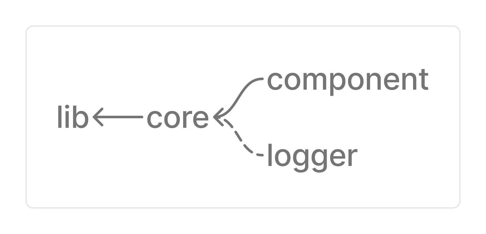

# 250404 monorepo

This project is for study purposes.

## Relevant knowledge

- pnpm workspace
- turbo
- @changesets/cli

## Branches

Checkout these branches to study.

- only-pnpm: pnpm workspace only
- turbo: pnpm workspace + turbo
- changesets: pnpm workspace + turbo + changesets

## Start

Install `pnpm@9.12.3` globally. Make sure to use `node@22.12.0`.

```bash
> sudo npm i -g pnpm@9.12.3
```

Alternatively, you can use `nvm` and `corepack`

```bash
> nvm use 22.12.0

> npm i -g corepack@latest

> npx corepack enable pnpm
```

Install dependencies.

```bash
> pnpm i --frozen-lockfile
```

Now, you are ready to execute the project 🎉.

## Description

Project has four workspaces.

```text
packages/
├── component
├── core
├── lib
└── logger
```

Dependency graph:

- `←` : dependencies
- `⇠` : peerDependencies, devDependencies

